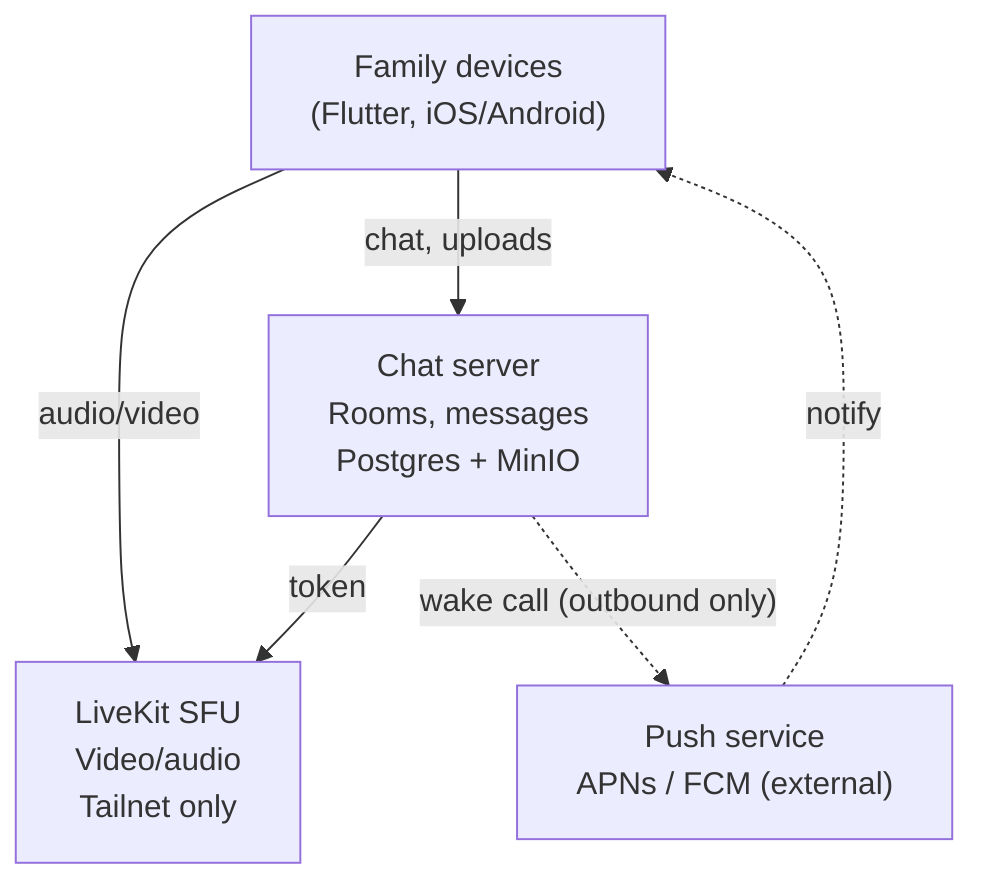

# Roost — architecture overview

Self-hosted chat, media sharing, and video calling for family use, running on a home cluster over a private Tailscale network.

## Goals

- Reliable video calling — the specific pain point ("VoIP often doesn't work") that motivated this project
- Chat with rich media: images, video, and location sharing
- Fully self-hosted and privately run, with no public network exposure
- A mobile-first experience that feels native, including real incoming-call behavior
- A build that's realistic for a single person to build and operate

## Non-functional requirements

| Attribute | Requirement |
|---|---|
| **Network exposure** | No inbound ports opened on the home router; all inbound traffic arrives over Tailscale |
| **Availability** | Best-effort, home-cluster-grade — not a 24/7 SLA; brief downtime for maintenance is acceptable |
| **Latency (calls)** | Low enough for natural conversation between tailnet peers; direct WireGuard paths preferred over relay |
| **Privacy** | Media and messages stay on infrastructure the user controls; push payloads carry no sensitive content (no call tokens, no message bodies) |
| **Data retention** | Location shares stop updating and being visible after a sender-chosen TTL; shared images and video persist indefinitely with no expiry |
| **Scale** | Sized for a family (single-digit to low tens of users), not general multi-tenant use |
| **Portability** | Services run in containers, deployable to the user's k3s cluster; the whole stack is expressible as Kubernetes manifests rather than tied to a single host |
| **Maintainability** | Minimal ongoing ops burden for one part-time maintainer — favor managed/off-the-shelf components over custom infrastructure wherever the requirements allow it |
| **Client platform support** | Current iOS and Android versions capable of CallKit/ConnectionService and background push (iOS 16.4+) |

## Architecture principles

1. **No open ports, ever.** All inbound access happens over Tailscale; the only outbound exception is push notifications, which the platform initiates and which require no listener.
2. **Reuse mature infrastructure for hard, generic problems; build only what's product-specific.** WebRTC/SFU, object storage, relational storage, and network transport are reused; chat semantics, location expiry, and UX are built.
3. **Signaling and media are separate paths.** The chat server brokers calls (auth, tokens) but never touches audio/video — media flows directly between clients and the SFU.
4. **Simplicity over standards compliance.** The platform optimizes for this specific deployment rather than interoperability with other servers or third-party clients; standards compliance is revisited only if that need actually arises.
5. **Trust follows the network.** Because only family members are ever on the tailnet, network identity (Tailscale) doubles as application identity — no separate credential system.
6. **Location shares are ephemeral by default.** Location messages carry an expiry; shared images and video persist indefinitely unless removed.

## High-level architecture

All services bind to the Tailscale interface only; devices reach everything via MagicDNS/tailnet IPs. The only traffic ever leaving the cluster is the outbound push call to APNs/FCM — nothing external ever initiates a connection inward.

## Architecture decisions

**The chat server is the one fully custom-built core component.**
API, WebSocket handling, rooms, and messages are product-specific enough to own outright — this is where the UX control that motivated the whole project actually lives. Every other decision below is about what this server depends on or delegates to.

**Custom protocol instead of a standard spec (Matrix).**
Adopting a standard protocol buys interoperability and existing client/server ecosystems, but that value is tied to needs this deployment doesn't have — federating with other servers, or supporting third-party clients. Matrix specifically also brings its hardest engineering costs (federation, state resolution) for no benefit in a single-family, single-homeserver setup. A purpose-built protocol trades away compatibility for a faster build and a simpler system, which is the right trade here; it would need revisiting if federation or third-party client support ever became a goal.

**Tailscale for all networking, no TURN/coturn.**
Every participant is assumed to be on the tailnet. Tailscale's WireGuard-based hole-punching (with DERP relay fallback) covers what TURN would otherwise be needed for, so a dedicated TURN server is dropped from the design.

**Postgres for structured data, not a bespoke store.**
Users, rooms, messages, and media pointers live in a standard relational database. At family scale there's no case for anything more specialized.

**MinIO for object storage.**
Images and video are stored in MinIO, an S3-compatible self-hosted object store — avoids building a custom upload/file-serving layer for content that has no special requirements beyond "store the file, serve it back."

**LiveKit as the SFU, not a custom WebRTC stack.**
WebRTC's real complexity — ICE/ICE candidates, media routing, avoiding mesh-call bandwidth blowup — is exactly the kind of infrastructure code that's high-effort and high-risk to get right. LiveKit is self-hosted, has good client SDKs, and is a common substitute specifically because Matrix's native VoIP (Element Call / MSC3401) has been unreliable in practice.

**Chat server brokers signaling, never touches media.**
The chat server's only involvement in a call is minting a LiveKit access token for the room; actual audio/video flows directly between each client and LiveKit over the tailnet. Keeps the chat server simple and stateless with respect to media.

**Tailscale identity instead of a custom auth system.**
Since only family members are ever on the tailnet, there's no need for passwords, signup flows, or session management — the connecting Tailscale identity is trusted as the user.

**Location sharing stops at a sender-chosen TTL — no cleanup job needed.**
The sender picks how long their location updates are shared at send time (e.g. 15 min / 1 hr / until I arrive), stored as `expires_at` on the message. The TTL governs *sharing*, not storage: once it elapses, the client stops sending location updates and the server stops accepting/serving them for that share — a read-time check against `expires_at`, not a deletion trigger. There's no background sweep or cron job involved; the rows are small structured data in Postgres, not accumulating media files, so there's no storage-growth problem to solve. The row can simply stay in the database once the share has ended.

**Mobile-first with Flutter, not a PWA.**
Reliable calling requires native CallKit/ConnectionService integration for lock-screen answer UI and APNs/FCM-triggered wake-up — capabilities a PWA can't reach, particularly on iOS. Flutter covers iOS + Android from one codebase and has an official LiveKit SDK, keeping the "reuse the SFU integration" logic consistent with the server-side decision. Desktop is deferred; nothing above precludes adding it later.

**Guests stay out of scope for now.**
The platform is tailnet-only, family-only, with no guest access path. If a non-tailnet guest use case comes up later, it gets designed then — likely reintroducing a TURN server and/or a cloudflared-fronted web client for chat, while keeping call media tailnet-only.

**Push delivery via APNs/FCM, the one accepted external dependency.**
Everything else in the stack is self-hosted; push is the single exception, accepted because it's the only way to wake a backgrounded iOS app for CallKit to take over. It stays scoped to outbound wake-up calls only (see the call flow below), so it doesn't reopen the "no open ports" principle.

**Deploy on k3s using the Tailscale Kubernetes operator, not `hostNetwork`.**
Running on k3s means services live in pod network namespaces by default, not directly on the host's Tailscale interface — so "no open ports" needs a deliberate mechanism, not just a config flag. The Tailscale Kubernetes operator exposes chosen Services onto the tailnet directly (each gets its own tailnet identity/IP), which keeps every service reachable only over Tailscale without resorting to `hostNetwork: true` or manually running a `tailscaled` sidecar in every pod. Each core service (chat server, LiveKit, MinIO, Postgres) deploys as its own Deployment/StatefulSet; official Helm charts are used for Postgres, MinIO, and LiveKit where available, with only the chat server and its manifests being fully custom.

Devices on the tailnet aren't always reachable over the WebSocket — a backgrounded or closed app on iOS gets suspended, so the chat server can't rely on that connection to wake it for an incoming call. APNs/FCM solve this, and using them doesn't reopen the "no open ports" constraint: the chat server calls out to Apple/Google's push endpoints (outbound HTTPS), it never accepts inbound connections from them.

Call flow:
1. Caller's client sends "start call" to the chat server over the tailnet WebSocket.
2. Chat server mints a LiveKit token for the room and looks up the callee's device.
3. If the callee's WebSocket is connected (app in foreground/background-but-alive), the chat server sends the call invite directly over it.
4. If not, the chat server sends a push via APNs (iOS) or FCM (Android) containing just enough data to wake the app and identify the call — not the token itself, since push payloads aren't guaranteed encrypted end-to-end the way tailnet traffic is.
5. The push wakes the app, which triggers CallKit/ConnectionService to show the native incoming-call screen.
6. On answer, the app connects back over the tailnet to the chat server to fetch the actual LiveKit token, then joins the LiveKit room directly.
7. Media flows client-to-LiveKit over the tailnet, same as before — push and the chat server are never in the media path.

This keeps the sensitive part (the LiveKit token) off Apple/Google's servers — push only ever carries a "you're being called, ask the chat server for details" wake-up signal.

**Chat server joins the tailnet itself, via `tsnet`, rather than relying solely on the operator's generic Service exposure.**
"Tailscale identity instead of a custom auth system" requires resolving, per request, *which* tailnet identity is calling — not just gating network reachability. That needs a LocalAPI `WhoIs` lookup against the connection, which only the tailnet node that terminated the connection can answer. The Tailscale Kubernetes operator's normal `LoadBalancer`-class Service exposure puts a separate proxy pod in front of the app, so the app container itself never sees a real tailnet connection to ask about. Embedding `tsnet` (a tailnet node inside the chat server binary itself) sidesteps that: the pod is its own tailnet node, `ts.Listen` is what accepts client connections, and `LocalClient.WhoIs` resolves the caller directly. This still satisfies "no `hostNetwork`, no open ports" — `tsnet` opens no inbound port outside the tailnet either. LiveKit doesn't need this: it trusts a signed JWT minted by the chat server rather than resolving identity itself, so it's exposed the simpler way, via the operator's `LoadBalancer`-class Service. Postgres and MinIO are never tailnet-exposed at all — only the chat server talks to them, over the cluster-internal network.

## Open questions

None currently — revisit if the guest-access or location-sharing assumptions change.
