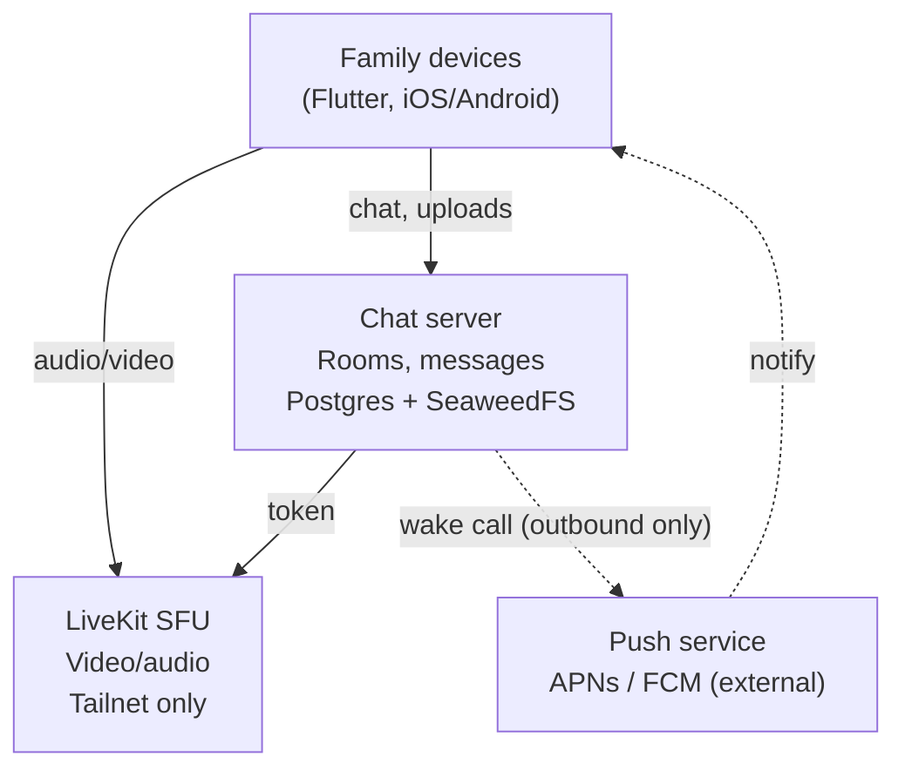

# Roost — architecture overview

Self-hosted chat, media sharing, and video calling for family use, running on a home cluster over a private Tailscale network.

## Goals

- Reliable video calling — the specific pain point ("VoIP often doesn't work") that motivated this project
- Chat with rich media: images, video, and location sharing
- Fully self-hosted and privately run, with no public network exposure
- A mobile-first experience that feels native, including real incoming-call behavior
- A build that's realistic for a single person to build and operate

## Non-functional requirements

| Attribute | Requirement |
|---|---|
| **Network exposure** | No inbound ports opened on the home router; all inbound traffic arrives over Tailscale |
| **Availability** | Best-effort, home-cluster-grade — not a 24/7 SLA; brief downtime for maintenance is acceptable |
| **Latency (calls)** | Low enough for natural conversation between tailnet peers; direct WireGuard paths preferred over relay |
| **Privacy** | Media and messages stay on infrastructure the user controls; push payloads carry no call tokens, and a message notification's preview travels only end-to-end encrypted to the receiving device, so Apple and Google see ciphertext |
| **Data retention** | Location shares stop updating and being visible after a sender-chosen TTL; shared images and video persist indefinitely with no expiry |
| **Scale** | Sized for a family (single-digit to low tens of users), not general multi-tenant use |
| **Portability** | Services run in containers, deployable to the user's k3s cluster; the whole stack is expressible as Kubernetes manifests rather than tied to a single host |
| **Maintainability** | Minimal ongoing ops burden for one part-time maintainer — favor managed/off-the-shelf components over custom infrastructure wherever the requirements allow it |
| **Client platform support** | Current iOS and Android versions capable of CallKit/ConnectionService and background push (iOS 16.4+). On iOS the app is iPhone-only (an iPad runs the iPhone version); its layout was never designed for iPad, and a universal build would need iPad screenshots for every store submission |

## Architecture principles

1. **No open ports, ever.** All inbound access happens over Tailscale; the only outbound exceptions are push notifications and link-preview fetches, both initiated by the server and requiring no listener.
2. **Reuse mature infrastructure for hard, generic problems; build only what's product-specific.** WebRTC/SFU, object storage, relational storage, and network transport are reused; chat semantics, location expiry, and UX are built.
3. **Signaling and media are separate paths.** The chat server brokers calls (auth, tokens) but never touches audio/video — media flows directly between clients and the SFU.
4. **Simplicity over standards compliance.** The platform optimizes for this specific deployment rather than interoperability with other servers or third-party clients; standards compliance is revisited only if that need actually arises.
5. **Trust follows the network.** Because only family members are ever on the tailnet, network identity (Tailscale) doubles as application identity — no separate credential system.
6. **Location shares are ephemeral by default.** Location messages carry an expiry; shared images and video persist indefinitely unless removed.

## High-level architecture

```mermaid
flowchart TB
    Client["Family devices\n(Flutter, iOS/Android)"]
    Chat["Chat server\nRooms, messages\nPostgres + SeaweedFS"]
    LiveKit["LiveKit SFU\nVideo/audio\nTailnet only"]
    Push["Push service\nAPNs / FCM (external)"]

    Client -- "chat, uploads" --> Chat
    Client -- "audio/video" --> LiveKit
    Chat -- "token" --> LiveKit
    Chat -. "wake call (outbound only)" .-> Push
    Push -. "notify" .-> Client
```

All services bind to the Tailscale interface only; devices reach everything via MagicDNS/tailnet IPs. The only traffic ever leaving the cluster is the outbound push call to APNs/FCM — nothing external ever initiates a connection inward.

## Architecture decisions

**The chat server is the one fully custom-built core component.**
API, WebSocket handling, rooms, and messages are product-specific enough to own outright — this is where the UX control that motivated the whole project actually lives. Every other decision below is about what this server depends on or delegates to.

**Custom protocol instead of a standard spec (Matrix).**
Adopting a standard protocol buys interoperability and existing client/server ecosystems, but that value is tied to needs this deployment doesn't have — federating with other servers, or supporting third-party clients. Matrix specifically also brings its hardest engineering costs (federation, state resolution) for no benefit in a single-family, single-homeserver setup. A purpose-built protocol trades away compatibility for a faster build and a simpler system, which is the right trade here; it would need revisiting if federation or third-party client support ever became a goal.

**Tailscale for all networking, no TURN/coturn.**
Every participant is assumed to be on the tailnet. Tailscale's WireGuard-based hole-punching (with DERP relay fallback) covers what TURN would otherwise be needed for, so a dedicated TURN server is dropped from the design.

**Postgres for structured data, not a bespoke store.**
Users, rooms, messages, and media pointers live in a standard relational database. At family scale there's no case for anything more specialized.

**SeaweedFS for object storage, not MinIO.**
Images and video are stored in an S3-compatible self-hosted object store — avoids building a custom upload/file-serving layer for content that has no special requirements beyond "store the file, serve it back." This was MinIO until 2026-09, when MinIO Inc. discontinued the free community edition entirely: Docker Hub pulls were killed 2026-09-11, the quay.io mirror everyone redirected to was locked down too on 2026-09-24 (a 401 Unauthorized on `quay.io/minio/minio:latest` is what triggered this switch), and upstream MinIO itself had already been archived ("no longer maintained") months earlier. The only image left under MinIO's name, `quay.io/minio/aistor/minio`, is their commercial AIStor product and needs a paid Docker ELS entitlement — not viable for a project with no paid third-party dependencies anywhere else. SeaweedFS (Apache-2.0, actively maintained, the community's own most-cited replacement for exactly this migration) took its place: same S3 API, so `internal/storage`'s client code is completely unchanged, only the endpoint/credentials in `docker-compose.yml`/`k8s/seaweedfs/` differ. `weed server -s3` runs its master, volume, filer, and S3 gateway in one process, matching MinIO's own single-binary simplicity for this single-node deployment.

**LiveKit as the SFU, not a custom WebRTC stack.**
WebRTC's real complexity — ICE/ICE candidates, media routing, avoiding mesh-call bandwidth blowup — is exactly the kind of infrastructure code that's high-effort and high-risk to get right. LiveKit is self-hosted, has good client SDKs, and is a common substitute specifically because Matrix's native VoIP (Element Call / MSC3401) has been unreliable in practice.

**Chat server brokers signaling, never touches media.**
The chat server's only involvement in a call is minting a LiveKit access token for the room; actual audio/video flows directly between each client and LiveKit over the tailnet. Keeps the chat server simple and stateless with respect to media.

**Tailscale identity instead of a custom auth system.**
Since only family members are ever on the tailnet, there's no need for passwords, signup flows, or session management — the connecting Tailscale identity is trusted as the user.

**Location sharing stops at a sender-chosen TTL — no cleanup job needed.**
The sender picks how long their location updates are shared at send time (e.g. 15 min / 1 hr / until I arrive), stored as `expires_at` on the message. The TTL governs *sharing*, not storage: once it elapses, the client stops sending location updates and the server stops accepting/serving them for that share — a read-time check against `expires_at`, not a deletion trigger. There's no background sweep or cron job involved; the rows are small structured data in Postgres, not accumulating media files, so there's no storage-growth problem to solve. The row can simply stay in the database once the share has ended.

**Location sharing tracks in the background, not just foreground.**
A share keeps updating while the app is backgrounded or the phone is locked (e.g. sharing while driving with the screen off), not just while the chat is open. This needs "Always" location permission, an Android foreground service with a persistent notification (`AndroidSettings.foregroundNotificationConfig` in `package:geolocator`), and iOS background location mode (`UIBackgroundModes: [location]` + `AppleSettings.allowBackgroundLocationUpdates`) — real native platform configuration, not just a Dart-level setting, and a stronger permission ask than most of this app's other features. It does **not** survive the user force-quitting the app from the app switcher: `geolocator`'s Android foreground notification raises process priority to make that less likely, but doesn't run independently of the app process the way a dedicated background-service plugin would — accepted as a reasonable limit rather than pulling in that additional complexity for a family app.

**Mobile-first with Flutter, not a PWA.**
Reliable calling requires native CallKit/ConnectionService integration for lock-screen answer UI and APNs/FCM-triggered wake-up — capabilities a PWA can't reach, particularly on iOS. Flutter covers iOS + Android from one codebase and has an official LiveKit SDK, keeping the "reuse the SFU integration" logic consistent with the server-side decision. Desktop is deferred; nothing above precludes adding it later.

**Guests stay out of scope for now.**
The platform is tailnet-only, family-only, with no guest access path. If a non-tailnet guest use case comes up later, it gets designed then — likely reintroducing a TURN server and/or a cloudflared-fronted web client for chat, while keeping call media tailnet-only.

**Push delivery via APNs/FCM, the one accepted external dependency.**
Everything else in the stack is self-hosted; push is the single exception, accepted because it's the only way to wake a backgrounded iOS app for CallKit to take over (FR5.1), and to notify either platform of a new message once the WebSocket connection has dropped (FR5.2). Both stay scoped to outbound wake-up/notify calls only (see the call flow below), never carrying message content, so it doesn't reopen the "no open ports" principle.

**Link previews (FR1.14), the second accepted external dependency.**
Rendering a title/description/image card for a URL a family member shares means fetching that URL's HTML somewhere. Rather than have every client device fetch arbitrary third-party URLs directly, the chat server does it (`internal/linkpreview`): one outbound HTTPS GET to read `<meta property="og:...">` tags, same shape as the push exception — server-initiated, no listener, nothing external ever connects in. Because this fetches URLs family members paste in (arbitrary user input), the server's dialer additionally refuses to connect to private/loopback/link-local addresses, so a pasted link can't be used to probe the cluster's internal network (Postgres, SeaweedFS) from inside the chat server's own pod.

**Location-share map snapshot (FR3.7), the third accepted external dependency.**
Once a location share ends, its preview switches from a live map to a single static image of the last known position — a live Maps SDK view would otherwise reload (and re-bill) on every rebuild of an already-ended share. Rather than have the client fetch that image directly from Google's Static Maps API (which would put a Google API key on the client and run into Android/iOS key-restriction headers a raw HTTP call can't supply), the chat server fetches it once (`internal/staticmap`) and stores it as an ordinary media object, the same "server-initiated, no listener" shape as the two exceptions above. Unlike link previews, there's no arbitrary user-supplied URL here — only a lat/lng into a fixed, compile-time-known Google host — so the private-address-blocking dialer isn't needed.

**Deploy on k3s with each client-facing service joining the tailnet itself, not `hostNetwork`.**
Running on k3s means services live in pod network namespaces by default, not directly on the host's Tailscale interface — so "no open ports" needs a deliberate mechanism, not just a config flag. The original plan was the Tailscale Kubernetes operator, which exposes chosen Services onto the tailnet via a proxy pod. That turned out to work for the chat server's identity resolution and LiveKit's media path in neither case (see the two decisions below), so both now run as tailnet nodes in their own right — the chat server by embedding `tsnet` in-process, LiveKit via a Tailscale sidecar container. The operator is no longer a dependency. Postgres and SeaweedFS stay purely cluster-internal and need no tailnet presence at all. Each core service deploys as its own plain Kubernetes Deployment — no Helm; see `k8s/README.md` for the manifests and the secrets each one expects.

Devices on the tailnet aren't always reachable over the WebSocket — a backgrounded or closed app on iOS gets suspended, so the chat server can't rely on that connection to wake it for an incoming call. APNs/FCM solve this, and using them doesn't reopen the "no open ports" constraint: the chat server calls out to Apple/Google's push endpoints (outbound HTTPS), it never accepts inbound connections from them.

Call flow:
1. Caller's client sends "start call" to the chat server over the tailnet WebSocket.
2. Chat server mints a LiveKit token for the room and looks up the callee's device.
3. If the callee's WebSocket is connected (app in foreground/background-but-alive), the chat server sends the call invite directly over it.
4. If not, the chat server sends a push via APNs (iOS) or FCM (Android) containing just enough data to wake the app and identify the call — not the token itself, since push payloads aren't guaranteed encrypted end-to-end the way tailnet traffic is.
5. The push wakes the app, which triggers CallKit/ConnectionService to show the native incoming-call screen.
6. On answer, the app connects back over the tailnet to the chat server to fetch the actual LiveKit token, then joins the LiveKit room directly. Answering on the native screen joins straight into the in-app call (no second in-app accept), and the native call's lifecycle stays tied to the in-app one: hanging up either ends both, and the call finishing server-side (caller gave up, answered elsewhere) ends the native ring — see `app/lib/services/native_call.dart`.
7. Media flows client-to-LiveKit over the tailnet, same as before — push and the chat server are never in the media path.
8. An unanswered call ends as **missed** (FR4.8). The caller's app gives up after its 30-second ring timeout and says so ("no answer"), which ends the call as missed even if the other side accepted but never connected (e.g. answered on the lock screen, joined only once unlocked). As a backstop for when the caller's app can't (closed, offline, or off the call screen), the chat server itself marks any call still ringing unanswered after 45 seconds as missed and tells the room (`server/internal/api/call_expiry.go`). In a 1:1 call either side hanging up ends it for both; a group call ends when its last participant leaves. A call's talk time runs from when it was answered to when it ended.

This keeps the sensitive part (the LiveKit token) off Apple/Google's servers — push only ever carries a "you're being called, ask the chat server for details" wake-up signal.

FR5.2 (new-message notifications) follows the same WS-first, push-fallback shape. The payload identifies the room/message and carries the sender's name as the title. The message preview itself is end-to-end encrypted, because push transport isn't encrypted end to end the way tailnet traffic is and message content shouldn't be readable outside infrastructure the family controls. Each device makes its own X25519 key pair and registers the public key (`devices.push_public_key`); for every notification the server seals the preview to that key with a fresh ephemeral key pair (`server/internal/cryptobox`: X25519 + HKDF-SHA256 + ChaCha20-Poly1305), so APNs and FCM only ever see ciphertext. On iOS the notification arrives with generic text and `mutable-content`, and a notification service extension (`app/ios/NotificationServiceExtension/`) decrypts the preview with the private key from the keychain (shared with the app through the App Group) before it's shown. On Android the notification is data-only and the app decrypts and shows it itself. A device without a key, or any failure to decrypt, falls back to the generic text. The sender's profile picture replaces the app icon on the notification, but only its media id travels through push: the device fetches the small preview from the chat server over the tailnet (the NSE on iOS, which then makes it a Communication Notification via `INSendMessageIntent`; the app on Android, as a MessagingStyle person icon), and shows the notification without it if that fails. The Go, Dart and Swift implementations are checked against one shared test vector. The app asks for notification permission only once it has reached the family's server (never on the "can't reach the server" screen, where App Store reviewers start, or in the demo). Both platforms deliver this half through FCM (a message-notification token is itself an FCM token on iOS too, obtained via `firebase_messaging` rather than PushKit — a plain alert doesn't need PushKit/CallKit's wake guarantees the way a call does); a single iOS device therefore registers two tokens, one PushKit ("voip", FR5.1) and one FCM ("fcm", FR5.2) — see `docs/data-model.md`'s `devices` table.

**Chat server joins the tailnet itself, via `tsnet`, rather than relying solely on the operator's generic Service exposure.**
"Tailscale identity instead of a custom auth system" requires resolving, per request, *which* tailnet identity is calling — not just gating network reachability. That needs a LocalAPI `WhoIs` lookup against the connection, which only the tailnet node that terminated the connection can answer. The Tailscale Kubernetes operator's normal `LoadBalancer`-class Service exposure puts a separate proxy pod in front of the app, so the app container itself never sees a real tailnet connection to ask about. Embedding `tsnet` (a tailnet node inside the chat server binary itself) sidesteps that: the pod is its own tailnet node, `ts.Listen` is what accepts client connections, and `LocalClient.WhoIs` resolves the caller directly. This still satisfies "no `hostNetwork`, no open ports" — `tsnet` opens no inbound port outside the tailnet either. Postgres and SeaweedFS are never tailnet-exposed at all — only the chat server talks to them, over the cluster-internal network.

**LiveKit is also its own tailnet node, via a Tailscale sidecar — for a different reason than the chat server.**
It doesn't need per-request identity (it trusts the chat server's signed JWT), so the operator's `LoadBalancer`-class Service looked sufficient, and that's how it was first deployed. It isn't: an SFU has to advertise ICE candidate addresses that clients can actually route to, and behind the operator's proxy LiveKit sees only its own pod IP (`10.42.x.x`). Clients connected to signaling fine and then failed media negotiation with `Timed Out waiting for PeerConnection to connect`, because the only candidate on offer was an address unreachable from the tailnet. Signaling proxies cleanly; real-time media does not, because media needs the server to know its own client-reachable address.

A Tailscale sidecar sharing LiveKit's pod network namespace resolves it the same way `tsnet` does for the chat server — the pod becomes a genuine tailnet node with a `100.x.y.z` address, `rtc.node_ip` advertises it, and media flows client-to-pod directly over WireGuard with full UDP and nothing in the path. LiveKit consequently needs no Kubernetes `Service` at all, the same as the chat server. The trade-off is one narrow privilege: the sidecar needs `NET_ADMIN` for kernel-mode networking (userspace mode forwards inbound UDP poorly). Since both the `restricted` and `baseline` Pod Security profiles forbid adding that capability, the namespace carries no PSS label at all — the per-pod `securityContext` hardening remains the real control, and LiveKit's own container still runs non-root with every capability dropped. See `k8s/README.md`'s Hardening section for the reasoning and what that gives up. The generalisable rule this established: anything clients must reach *directly* becomes a tailnet node itself; only cluster-internal services sit behind ordinary Kubernetes networking.

**The app-store review demo runs entirely on the device, with no demo server.**
App store reviewers can't join a family's tailnet, so the app can't be reviewed against a real server. Rather than expose a public demo instance (which would need the first inbound public endpoint, abuse controls, and careful isolation from family data), the app carries its own in-memory stand-in for the chat server (`app/lib/demo/`): it answers every API call and emits the same WebSocket events the real server does, seeded with a small sample family, so every screen works unchanged. Nothing leaves the phone and nothing about the "no open ports" principle changes. Calls are the one gap — they need LiveKit and a second participant — so the demo explains that instead of calling. The trade-off: the demo is offered via a build setting (`DEMO_AVAILABLE`), so switching it off takes a new release rather than a server-side switch, which is acceptable because the demo can't reach anything worth protecting.

## Open questions

None currently — revisit if the guest-access or location-sharing assumptions change.
